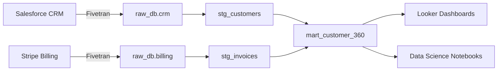

# Lineage Patterns

## Table of Contents

- dbt Lineage Graph Usage
- Column-Level Lineage Documentation
- Cross-System Lineage Documentation
- Lineage as Deliverable
- Manual Lineage for Non-dbt Transformations
- Lineage Gap Detection

---

## dbt Lineage Graph Usage

dbt generates a DAG automatically from `ref()` and `source()` calls. Access it via:

```bash
dbt docs generate && dbt docs serve
```

Navigate to a model and click "View Lineage" to see upstream/downstream dependencies.

CLI-based lineage inspection:

```bash
# Show all upstream dependencies of a model
dbt ls --select +mart_orders

# Show all downstream dependents of a source
dbt ls --select source:crm.accounts+

# Show 2-hop upstream lineage
dbt ls --select 2+mart_orders
```

Export lineage data programmatically from `target/manifest.json`:

```python
import json

with open("target/manifest.json") as f:
    manifest = json.load(f)

# Extract parent-child relationships
for node_id, node in manifest["nodes"].items():
    parents = node.get("depends_on", {}).get("nodes", [])
    if parents:
        print(f"{node_id} <- {parents}")
```

## Column-Level Lineage Documentation

dbt does not natively track column-level lineage. Document it manually in schema YAML:

```yaml
models:
  - name: mart_customer_360
    description: "Unified customer view combining CRM and billing data."
    columns:
      - name: lifetime_value
        description: "Sum of all invoice amounts. Source: billing.invoices.amount"
        meta:
          lineage_source: "billing.invoices.amount"
          transformation: "SUM(amount) GROUP BY customer_id"
      - name: acquisition_channel
        description: "First-touch marketing channel. Source: crm.leads.channel"
        meta:
          lineage_source: "crm.leads.channel"
          transformation: "FIRST_VALUE(channel) OVER (PARTITION BY customer_id ORDER BY created_at)"
```

For automated column-level lineage, consider SQLLineage or dbt-osmosis:

```bash
pip install sqllineage
sqllineage -f models/mart_customer_360.sql
```

## Cross-System Lineage Documentation

When data flows through systems outside dbt, document boundaries explicitly:

```yaml
# lineage_manifest.yml
systems:
  - name: salesforce_crm
    type: source
    extracts_to: raw_db.crm_salesforce
    extraction_tool: fivetran
    schedule: "every 6 hours"

  - name: dbt_transforms
    type: transformation
    reads_from: raw_db.crm_salesforce
    writes_to: analytics_db.mart_*
    orchestrator: dagster

  - name: looker
    type: consumption
    reads_from: analytics_db.mart_*
    access_pattern: "LookML models -> Explores -> Dashboards"

  - name: data_science
    type: consumption
    reads_from: analytics_db.mart_customer_360
    access_pattern: "Python notebooks via Snowflake connector"
```

## Lineage as Deliverable

For client-facing lineage diagrams, generate Mermaid syntax:

```markdown
## Data Flow: Customer 360


```

Include in lineage deliverables:
1. System-level flow diagram (Mermaid or draw.io)
2. Model-level DAG screenshot from dbt docs
3. Table of critical paths (source → final consumption)
4. Data freshness SLAs at each boundary

## Manual Lineage for Non-dbt Transformations

For transformations outside dbt (Python scripts, Spark jobs, stored procedures):

```yaml
# manual_lineage.yml
transformations:
  - name: daily_aggregation_job
    type: python_script
    script_path: scripts/daily_agg.py
    reads_from:
      - analytics_db.mart_orders
      - analytics_db.mart_customers
    writes_to:
      - analytics_db.agg_daily_summary
    schedule: "daily 06:00 UTC"
    owner: data-engineering
    last_reviewed: "2025-01-15"
```

Store manual lineage YAML alongside the transformation code. Include `last_reviewed` date to flag stale documentation.

## Lineage Gap Detection

Identify undocumented data flows by cross-referencing:

```sql
-- Snowflake: find tables with no dbt model (potential lineage gaps)
SELECT t.table_schema, t.table_name
FROM information_schema.tables t
LEFT JOIN (
    SELECT DISTINCT
        split_part(node_id, '.', 2) AS schema_name,
        split_part(node_id, '.', 3) AS table_name
    FROM dbt_manifest_nodes  -- parsed from manifest.json
) m ON t.table_name = m.table_name
WHERE m.table_name IS NULL
  AND t.table_schema NOT IN ('information_schema', 'pg_catalog');
```

Lineage gap checklist:
- All `source()` declarations have matching warehouse tables
- No warehouse tables exist without a corresponding dbt model or manual lineage entry
- Cross-system boundaries have documented extraction schedules
- Consumption layer (BI tools, notebooks) has documented access patterns
